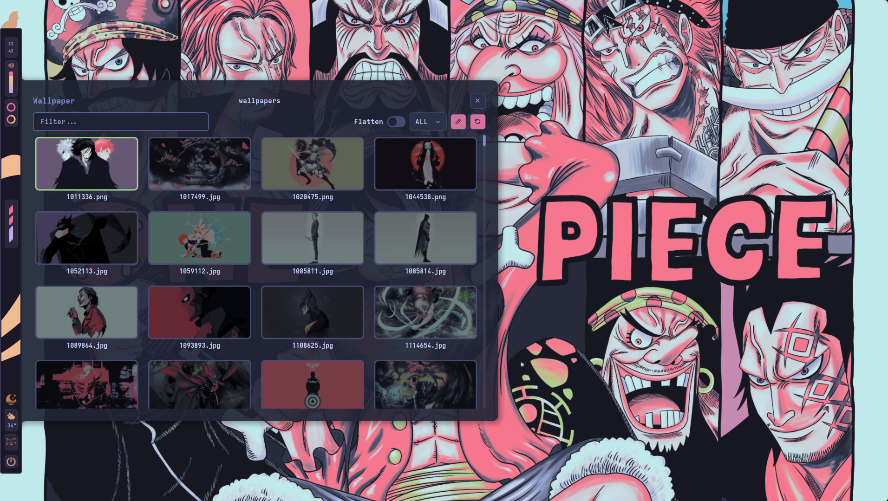
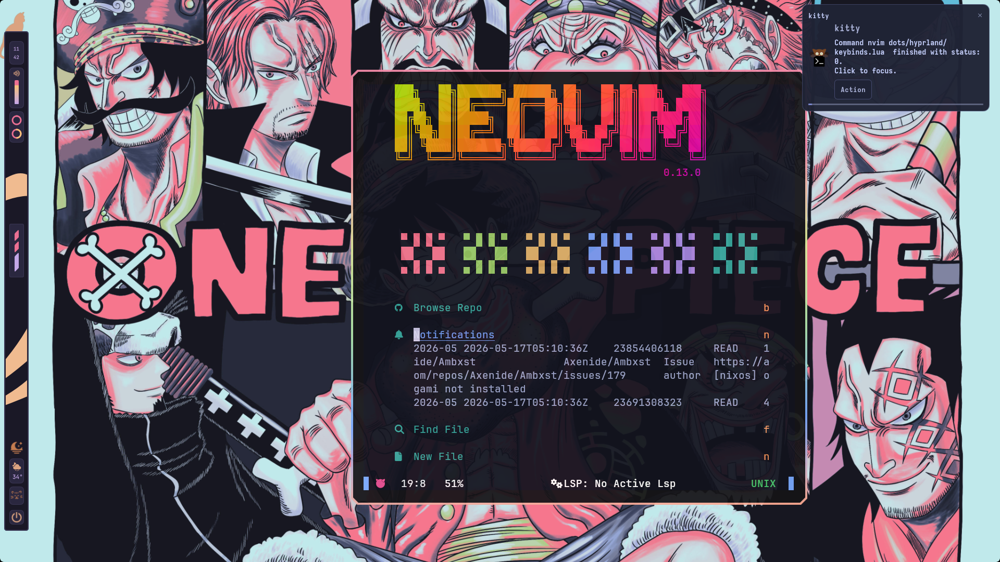
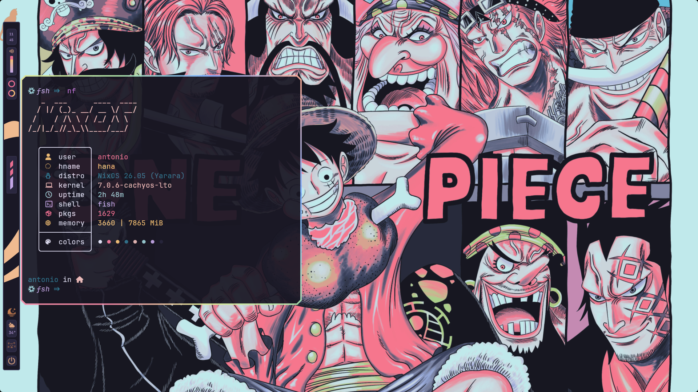

<h2>Greenhouse</h2>

My Nixos configuration (npins + dendritic pattern) FlakeLess Config

 

 

 

 
 

> [!WARNING]
> Very cursed config. I will adapt this config to be mine. Studying Purpose Originally from [Iamvismorf/Greenhouse](https://github.com/Iamvismorf/Greenhouse.git)
 

> [!WARNING]
> Later i will completely remove the _mkStoreSymlink. I will use the hjem-impure more precisely.
 

#### You have been warned
The entry point is [./modules/hosts](modules/hosts)

 

## Features
+ [modules/hosts/default.nix](modules/hosts/default.nix) Automatic host creation
+ [utils/_recursiveImport](utils/_recursiveImport.nix) 
    + see [./default.nix](default.nix) for example usage
+ [Impure symlink](utils/_mkStoreSymlink.nix) dotfiles experience like in traditional UNIX systems
    + see ./modules/hosts/hostName/hjem/username/username.nix for example usage
+[hjem-impure](./modules/hosts/kagura/hjem/antonio/antonio.nix) alternative for _mkStoreSymlink using hjem-impure
+ [inputs.nix](inputs.nix) Automatic inputs creation
+ [Nvim config](./dots/neovim/default.nix)
    + plugin manage by npins via mnw [start-plugins](./dots/neovim/start-plugins.json) & [opt-plugins](./dots/neovim/opt-plugins.json)   
+ [Just recipes](Justfile)

## Credits
+ [Rexcrazy804/Zaphkiel](https://github.com/Rexcrazy804/Zaphkiel)
+ [denful/dendritic-unflake](https://github.com/denful/dendritic-unflake)
+ [Iamvismorf/Greenhouse](https://github.com/Iamvismorf/Greenhouse.git)
+ [pinning with npins blog by Jade](https://jade.fyi/blog/pinning-nixos-with-npins/)
+ [pinning with npins blog by piegames](https://piegames.de/dumps/pinning-nixos-with-npins-revisited/)
